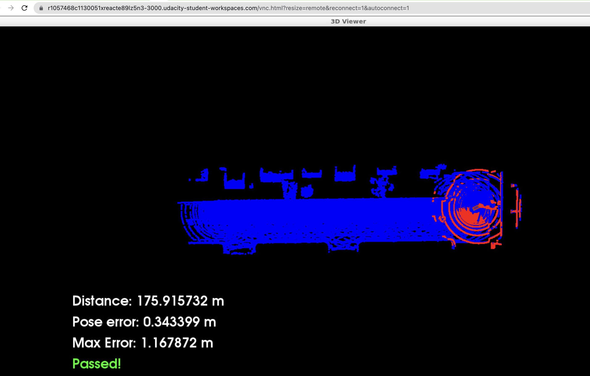
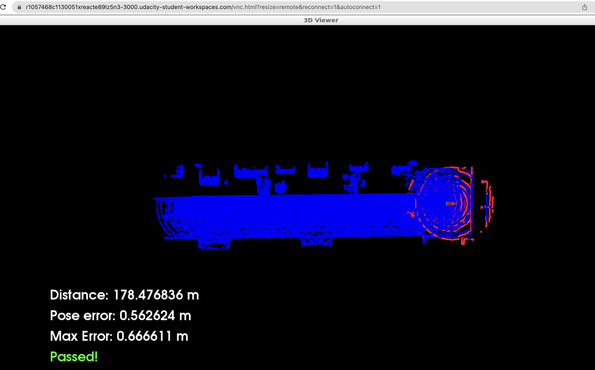

# nd013-scan-matching-localization
 
 
## Project Workspace
 
 
### Compile
cd /home/workspace/c3-project
 
cmake .
 
make
 
 
 
### Run
su - student // Ignore Permission Denied, if you see student@ you are good
 
cd /home/workspace/c3-project
 
./run_carla.sh
 
// Create new tab
 
cd /home/workspace/c3-project
 
./cloud_loc // Might have core dump on start up, just rerun if so. Crash doesn't happen more than a couple of times
 
 
 
 

## Vehicle driving and error screenshots after implementing ICP
 
 
 
 

### 3 iterations

 
 

 
 

### 9 iterations
 
 

 
 

 
 